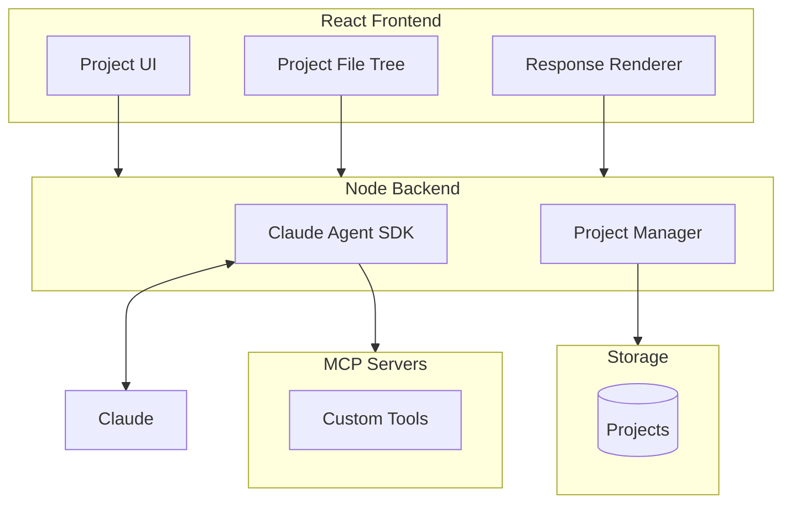

# Gimbal Architecture

## Overview

Gimbal is a GUI application that wraps Claude Code, providing a project-centric workspace for users doing work that produces digital artifacts. Claude responses are the generative engine; projects are containers where artifacts accumulate.

## Core Concepts

**Project**: A container for work. Artifacts accumulate here over time. Similar to how Google Earth organizes around geography, Gimbal organizes around the work itself.

**Structured Responses**: Claude returns data conforming to Gimbal's domain schema. The app renders responses; Claude produces data. Responses can be lists of items.

**Tools**: MCP servers expose capabilities to Claude (file operations, data fetching, etc.). Tools are configured per-project or globally.

## System Diagram

## Data Flow

1. User interacts with project UI
2. Backend sends prompt to Claude Agent SDK with project context and MCP config
3. Claude calls tools via MCP as needed
4. Claude returns structured response conforming to domain schema
5. Frontend renders response and updates project state

## Stack

- **Frontend**: TypeScript, React, Vite
- **Backend**: Node.js, Express, Claude Agent SDK
- **Tools**: MCP servers (stdio transport)

## Validated

- Client → Server → Claude Agent SDK → MCP tool calls → response → client
- Filesystem MCP server integration working
