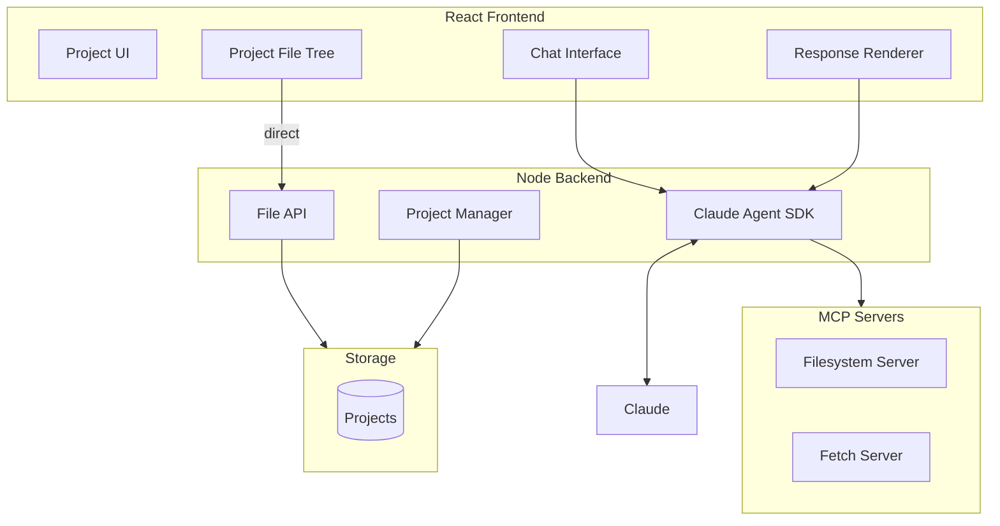

# Gimbal Architecture

## Overview

Gimbal is a GUI application that wraps Claude Code, providing a project-centric workspace for users doing work that produces digital artifacts. Claude responses are the generative engine; projects are containers where artifacts accumulate.

## Core Concepts

**Project**: A container for work. Artifacts accumulate here over time. Similar to how Google Earth organizes around geography, Gimbal organizes around the work itself.

**Structured Responses**: Claude returns data conforming to Gimbal's domain schema. The app renders responses; Claude produces data. Responses can be lists of items.

**Tools**: MCP servers expose capabilities to Claude (file operations, data fetching, etc.). Tools are configured per-project or globally.

## Two UI Paths

A key architectural insight: not everything should go through Claude.

**Direct UI controls** (fast, no latency):
- File tree browsing - click to expand folders, open files
- Basic file operations - create, rename, delete via context menus
- Project switching, settings, navigation

**Chat interface** (Claude-powered, accepts latency):
- Complex tasks: "download census data and analyze it"
- Questions: "what does this code do?"
- Synthesis: "summarize what I worked on today"
- Ambiguous intent that needs intelligence to interpret

This split avoids the latency tax on quick operations while preserving Claude's value for tasks that need it.

## System Diagram

## Data Flow

**Direct operations (file tree, etc.):**
1. User clicks in file tree
2. Frontend calls server File API directly
3. Server reads filesystem, returns immediately

**Claude operations (chat):**
1. User sends prompt via chat
2. Backend sends to Claude Agent SDK with MCP config
3. Claude calls tools via MCP as needed
4. Claude returns structured response
5. Frontend renders response and updates project state

## Stack

- **Frontend**: TypeScript, React, Vite
- **Backend**: Node.js, Express, Claude Agent SDK
- **Tools**: MCP servers (stdio transport)

## MCP Servers

Two MCP servers provide Claude's capabilities:

1. **Filesystem** (`@modelcontextprotocol/server-filesystem`)
   - Scoped to project directory
   - Tools: read_file, write_file, create_directory, list_directory

2. **Fetch** (`@gimbal/mcp-fetch` - custom)
   - Simple HTTP GET via Node fetch
   - Returns response body as text

## Validated

- Client → Server → Claude Agent SDK → MCP tool calls → structured response → client
- Filesystem MCP server scoped to project directory
- Custom fetch MCP server for web requests
- End-to-end: fetch Census API → save CSV to project (tested with WV county data)
- Structured response schema (Claude returns JSON, wrapped in markdown fences)
- Project isolation: each query starts fresh session, no context bleed between projects
- Sessions are stateless by default (SDK `query()` creates new session each call)

## Project Model

Projects stored in `~/.gimbal/projects.json`. Each project:
- Has unique ID, name, filesystem path
- Gets directory template on creation: CLAUDE.md, data/, scripts/, output/
- System prompt dynamically includes project path and CLAUDE.md contents

## Not Yet Implemented

- Conversation history (multi-turn within a project)
- Direct file API (bypassing Claude for fast operations)
- Client UI beyond basic prompt/response
