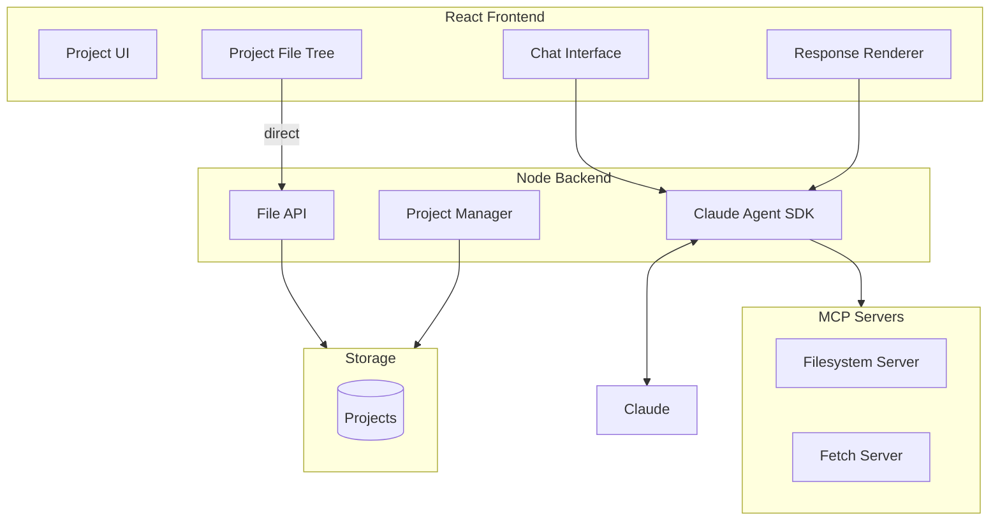

# Gimbal Architecture Brainstorm

> Greenfield architecture exploration. No sacred cows. Let's design something we're excited to build.

---

## Requirements

### Confirmed
- **AWS backend** — we're an AWS shop
- **Web frontend** — primary interface; native apps are roadmap

### Likely (let's confirm)
- **Multi-tenant** — many users, isolated data
- **Project storage** — each user has projects containing files, chat history, skills
- **Claude integration** — Agent SDK, streaming responses
- **Auth** — users need accounts (free tier + paid)
- **Billing** — Stripe, usage tracking, subscription management

### Open Questions
- **Real-time collaboration?** — single user per project, or could multiple people work together?
- **Offline support?** — web-only, or PWA with offline capability?
- **API access?** — do users/developers get programmatic access to their projects?
- **Self-host option?** — ever? or always SaaS-only?
- **Geographic distribution?** — single region to start, multi-region later?

---

## The Fun Constraints

Let's make this interesting. Some constraints that force good design:

1. **$20/mo cloud budget for first 100 users** — forces efficiency, no gold-plating
2. **Single developer can operate it** — no 3am pager duty, minimal moving parts
3. **Deploy in an afternoon** — simple enough to understand and ship quickly
4. **Scales to 10k users without rearchitecting** — but we're not building for 10k on day one

---

## Architecture Candidates

### Option A: "Lambda All The Things"
- API Gateway + Lambda for all backend logic
- S3 for project files
- DynamoDB for metadata (users, projects, sessions)
- No servers to manage

**Vibe:** Serverless purist. Pay per request. Scales to zero.

### Option B: "One Good Server"
- Single ECS/Fargate task or App Runner instance
- Postgres (RDS) for everything
- S3 for large files only
- Simple, debuggable, predictable costs

**Vibe:** Boring technology. Easy to reason about. Known failure modes.

### Option C: "Edge-First"
- CloudFront + Lambda@Edge for frontend
- Regional Lambda for API
- DynamoDB Global Tables
- S3 with replication

**Vibe:** Fast everywhere. Complex. Probably premature.

### Option D: "Hybrid Pragmatist"
- App Runner for API (scales to near-zero, but still a "server")
- Postgres for structured data
- S3 for files
- Lambda for async jobs (background tasks, webhooks)

**Vibe:** Best of both. Server where it helps, serverless where it helps.

---

## Component Breakdown

*What pieces do we actually need?*

| Component | Purpose | Options |
|-----------|---------|---------|
| **Web Frontend** | React SPA | CloudFront + S3, or served from API |
| **API** | REST/GraphQL | App Runner, Lambda, ECS |
| **Database** | Users, projects, metadata | Postgres (RDS), DynamoDB |
| **File Storage** | Project files, artifacts | S3 |
| **Auth** | User accounts | Cognito, Clerk, Auth0, roll-our-own |
| **AI** | Claude conversations | Direct API, Agent SDK |
| **Billing** | Subscriptions, usage | Stripe |
| **Background Jobs** | Long tasks, notifications | Lambda, SQS, Step Functions |
| **Secrets** | API keys, credentials | Secrets Manager |

---

## What's Interesting to Explore

- **Project storage model**: Files in S3 with metadata in Postgres? Or something cleverer?
- **Session management**: How do Claude conversations persist? SDK sessions are ephemeral.
- **Skills storage**: Where do user-created skills live? Part of project? Separate?
- **Cost isolation**: How do we track/limit per-user AI costs?
- **The streaming story**: SSE from App Runner? WebSockets? API Gateway limitations?

---

## Current Thinking

### Current Architecture (Local Prototype)

This is what we have today. It works, but is single-user and runs locally.

**What's validated:**
- Client → Server → Claude Agent SDK → MCP tool calls → structured response → client
- Filesystem MCP server scoped to project directory
- Custom fetch MCP server for web requests
- End-to-end: fetch Census API → save CSV to project
- Session resumption for multi-turn conversations
- Chat history persistence

**Known gaps for production:**
- Single-user only (no auth, no multi-tenancy)
- Local filesystem storage (need S3 for hosted)
- Sessions in memory (lost on server restart)

### Architecture Direction

Leaning toward **Option D (Hybrid Pragmatist)**:
- App Runner for API (scales to near-zero, familiar server model)
- Postgres for structured data (users, projects, sessions)
- S3 for project files
- Lambda for async jobs if needed later

This matches our constraints: simple to operate, $20/mo budget for 100 users, scales without rearchitecting.

---

## Decisions Log

*Decisions we've made and why.*

| Decision | Choice | Rationale | Date |
|----------|--------|-----------|------|
| | | | |

